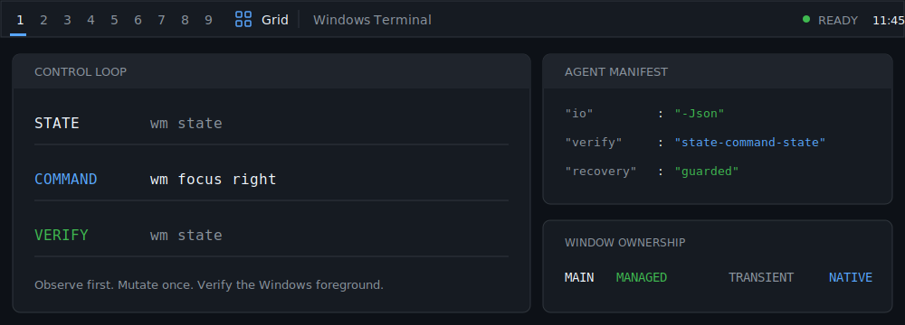

<div align="center">

# Komorebi Starter

**A deterministic, keyboard-driven Windows 11 desktop for people and coding agents.**

Komorebi, whkd, masir, and komorebi-bar, assembled into one reversible baseline.

[](https://github.com/702studio/komorebi-starter/actions/workflows/ci.yml)
[](https://github.com/702studio/komorebi-starter/releases/latest)

[](LICENSE)

</div>

<p align="center">
  <picture>
    <source media="(max-width: 520px)" srcset="docs/assets/readme-hero-mobile.svg">
    
  </picture>
</p>

## Install in one command

Open **Windows PowerShell** and run:

```powershell
irm https://raw.githubusercontent.com/702studio/komorebi-starter/main/bootstrap.ps1 | iex
```

> [!IMPORTANT]
> The command downloads `bootstrap.ps1` from the public `main` branch, then installs the latest verified release. Winget may request elevation for dependencies. Review [Trust and distribution](#trust-and-distribution) before running remote code.

**Requirements:** Windows 11, Windows PowerShell 5.1, and Winget.

### Agent-safe installation

Use JSON-only output, non-interactive execution, and a version you can pin:

```powershell
& ([scriptblock]::Create((irm 'https://raw.githubusercontent.com/702studio/komorebi-starter/main/bootstrap.ps1'))) -Version latest -NonInteractive -Quiet -Json
```

Inspect the plan without changing the system:

```powershell
& ([scriptblock]::Create((irm 'https://raw.githubusercontent.com/702studio/komorebi-starter/main/bootstrap.ps1'))) -Version latest -WhatIf -NonInteractive -Quiet -Json
```

Add `-MigrateFromGlazeWM` for an explicit GlazeWM takeover or `-InstallFonts` for JetBrains Mono Nerd Font. The migration preserves existing GlazeWM files while disabling its startup task so two window managers cannot start together.

## Why this baseline exists

- **Keyboard-first, Windows-aware.** Plain `Alt + Arrow` remains native to Windows and File Explorer. WM navigation has explicit shortcuts and CLI commands.
- **Agent-verifiable.** `wm state`, a small mutation, and another `wm state` form a deterministic control loop. Structured modes use JSON stdout and nonzero failure exits.
- **Focus is measured, not guessed.** Diagnostics compare Komorebi state with the Win32 foreground root, keyboard-focus child, mouse-under root, and active modal target.
- **Reversible by design.** Installation records owned files, backs up replaced configuration, and provides guarded restore and uninstall paths.
- **Native transient handling.** Browser-owned downloads, popovers, modal dialogs, tray helpers, Parsec, and Cinema 4D tools are classified separately from normal managed windows.

## What ships

| Layer | Responsibility |
| --- | --- |
| `komorebi` | Dynamic tiling, named workspaces, layouts, and machine-readable state |
| `whkd` | Global keyboard chords, kept separate from WM configuration |
| `masir` | Focus-follows-mouse only after relative pointer movement |
| `komorebi-bar` | Minimal workspace, layout, focused-window, and time surface |
| `wm.ps1` | Stable human and agent commands with verification and recovery behavior |
| `agent-manifest.json` | Machine contract for install options, paths, I/O, verification, and rollback |

The default visual surface is deliberately quiet: numbered workspaces, the active layout, the focused window, and time. A JetBrains Mono bar preset is included; Segoe UI Variable remains the zero-setup default.

## The agent control loop

Agents should read [`agent-manifest.json`](agent-manifest.json) before mutation.

```powershell
# 1. Observe
wm state

# 2. Apply one bounded command
wm focus left

# 3. Verify
wm state

# 4. Diagnose only when the expected focus did not become foreground
& "$env:LOCALAPPDATA\Programs\KomorebiStarter\wm.ps1" focus-health
```

For asynchronous `wm reload` and `wm restart`, poll `wm state` with bounded retries. `wm reload` uses a controlled process restart because Komorebi can retain removed matching rules after an in-process configuration replacement.

See [AGENTS.md](AGENTS.md) for the complete command and recovery contract.

## Controls

### Navigate

| Action | Control |
| --- | --- |
| Focus left/right/up/down from CLI | `wm focus left/right/up/down` |
| Native application navigation | `Alt + Left/Right/Up/Down` (not bound by this setup) |
| Previous/next workspace | `Alt + J` / `Alt + K` |
| Previous/next workspace, alternate | `Ctrl + Alt + Left` / `Ctrl + Alt + Right` |
| Previous/next active workspace | `Alt + A` / `Alt + S` |
| Last workspace | `Alt + D` |
| Focus workspace 1-9 | `Alt + 1-9` |

### Move windows and workspaces

| Action | Shortcut |
| --- | --- |
| Move focused window | `Alt + Shift + Up/Down/Left/Right` |
| Send to previous/next workspace | `Alt + Shift + J` / `Alt + Shift + K` |
| Send cycle, alternate | `Ctrl + Alt + Shift + Left/Right` |
| Send to workspace 1-9 | `Alt + Shift + 1-9` |
| Move and follow to workspace 1-9 | `Ctrl + Alt + 1-9` |
| Move workspace left/down/up/right | `Alt + Shift + A` / `Alt + Shift + S` / `Alt + Shift + D` / `Alt + Shift + F` |

### Resize and layout

| Action | Shortcut |
| --- | --- |
| Decrease/increase width | `Alt + H` / `Alt + L` |
| Increase/decrease height | `Alt + U` / `Alt + I` |
| Modal resize mode | `Alt + Y` |
| Toggle tiling direction | `Alt + Shift + Space` |
| Next/previous layout | `Ctrl + Alt + Space` / `Ctrl + Alt + Shift + Space` |
| Cycle layer | `Alt + OEM_5` (backslash key) |
| Toggle float | `Alt + Space` or `Alt + T` |
| Toggle fullscreen | `Alt + F` |
| Minimize / close | `Alt + N` / `Alt + Q` |
| Increase/decrease display scale | `Ctrl + Alt + Shift + Up/Down` |

### Lifecycle and launchers

| Action | Shortcut |
| --- | --- |
| Stop / pause | `Alt + Shift + E` / `Alt + Shift + P` |
| Restart | `Alt + Shift + Backspace` or `Alt + Shift + X` |
| Reload through controlled restart | `Alt + Shift + R` |
| Retile | `Alt + Shift + W` |
| Terminal / Firefox / Explorer | `Alt + Return` / `Alt + B` / `Alt + E` |
| Obsidian / Flow Launcher / Cursor | `Alt + O` / `Alt + R` / `Alt + C` |

[`config/whkdrc`](config/whkdrc) is the exact source of truth for every chord.

## Focus behavior and Parsec

`masir` changes focus only after relative mouse movement. A stationary pointer does not override keyboard-driven focus. Browser downloads and other owned tool windows remain native to their parent application instead of entering the tiling tree.

When an application disables its managed owner for a modal dialog, the focus wrapper targets the visible, enabled last-active popup. A directional command returns a nonzero exit code when Windows does not activate the verified target after bounded repair attempts.

Parsec can capture shortcuts before `whkd` receives them. With keyboard immersive mode active, use Parsec's configured **Immersive Mode** hotkey (default `Ctrl + Shift + I`) or **Detach Input** hotkey (default `Ctrl + Alt + Z`) before local WM shortcuts. This input boundary cannot be bypassed reliably by a local window-manager script.

Run the repeatable [focus QA matrix](docs/FOCUS_QA.md) before reporting or releasing focus changes.

## System footprint

| Purpose | Path or change |
| --- | --- |
| Configuration | `%USERPROFILE%\.config\komorebi` |
| Program files | `%LOCALAPPDATA%\Programs\KomorebiStarter` |
| Runtime state and logs | `%LOCALAPPDATA%\KomorebiStarter` |
| Startup | `KomorebiStarter` logon scheduled task |
| Dependencies | `LGUG2Z.komorebi`, `LGUG2Z.whkd`, `LGUG2Z.masir` through Winget |
| Optional font | `DEVCOM.JetBrainsMonoNerdFont` only with `-InstallFonts` |

A new terminal may be required before updated `PATH` entries are visible.

## Diagnose, reload, recover

```powershell
# Health and resolved paths
powershell.exe -NoProfile -ExecutionPolicy Bypass -File "$env:LOCALAPPDATA\Programs\KomorebiStarter\doctor.ps1" -Json

# Controlled configuration reload
& "$env:LOCALAPPDATA\Programs\KomorebiStarter\wm.ps1" reload

# Restore the pre-install desktop state
powershell.exe -NoProfile -ExecutionPolicy Bypass -File "$env:LOCALAPPDATA\Programs\KomorebiStarter\restore.ps1"

# Uninstall and preserve current configuration
powershell.exe -NoProfile -ExecutionPolicy Bypass -File "$env:LOCALAPPDATA\Programs\KomorebiStarter\uninstall.ps1"

# Uninstall and remove owned configuration
powershell.exe -NoProfile -ExecutionPolicy Bypass -File "$env:LOCALAPPDATA\Programs\KomorebiStarter\uninstall.ps1" -RemoveConfig
```

Recovery requires a validated install manifest and linked backup hashes. It will not treat arbitrary files as package-owned state.

## Trust and distribution

- The supported one-command path is the release-verifying bootstrap shown above.
- The release also contains `komorebi-starter-setup.exe`, ZIP and EXE SHA-256 files, validated WinGet manifests, and GitHub build attestations.
- The EXE does not currently carry an Authenticode publisher certificate.
- WinGet community availability is a separate registry process. Use the bootstrap unless this succeeds:

```powershell
winget show --exact --id 702studio.KomorebiStarter
```

When discovery succeeds, the package-manager command is:

```powershell
winget install --exact --id 702studio.KomorebiStarter
```

For a download-size, checksum, archive, and provenance walkthrough, use [Verified installation](docs/VERIFY_INSTALL.md).

## Project map

| Document | Use it for |
| --- | --- |
| [AGENTS.md](AGENTS.md) | Machine I/O, commands, bounded verification, and recovery |
| [agent-manifest.json](agent-manifest.json) | Parseable integration contract |
| [Verified installation](docs/VERIFY_INSTALL.md) | Manual release integrity and provenance checks |
| [Focus QA](docs/FOCUS_QA.md) | Repeatable native, browser, modal, and Parsec scenarios |
| [SECURITY.md](SECURITY.md) | Vulnerability reporting and support boundary |
| [SUPPORT.md](SUPPORT.md) | Diagnostics required for a useful bug report |
| [CONTRIBUTING.md](CONTRIBUTING.md) | Development, tests, and pull-request expectations |
| [CHANGELOG.md](CHANGELOG.md) | Release history |

## Licensing

Project scripts and configurations are [MIT licensed](LICENSE). Komorebi, whkd, and masir use the separate Komorebi License Version 2.0.0 (SPDX `NOASSERTION`). Its personal-use terms apply only to the uses listed upstream when no commercial application is anticipated; commercial use may require a separate license.

Read [THIRD_PARTY_NOTICES.md](THIRD_PARTY_NOTICES.md) before installing. Komorebi Starter does not replace or reinterpret upstream terms.

---

Built as a transparent Windows desktop baseline: inspect it, test it, change it, or remove it.
